# Getting started with It Hurts

**It Hurts** is a technical debt manager. It allows managing technical debt without leaving your IDE.
This page describes how to get started in a few steps:
- [Sign up](#sign-up)
- [Workspace setup](#workspace-setup)
  - [Teammates invitation](#teammates-invitation)
- [Plugin setup](#plugin-setup)
- [Usage and features](#usage-and-features)
  - [Reporting technical debt](#reporting-technical-debt)
  - [Browsing technical debts](#browsing-technical-debts)
  - [Changes tracking and debt cost](#changes-tracking-and-debt-cost)
  - [Types of bindings](#types-of-bindings)

## Sign up
* Navigate to https://ithurts.dev (or to your own instance of It Hurts if you are using it on-premise)
* Use _Continue with ..._ but on to sign up / sign in (currently, Bitbucket is the only option)
* You will be asked to give **read** access to your source code hosting provider account

## Workspace setup
To keep information about the code and related technical debts up to date It Hurts needs access (strictly read) to your code repositories.
It Hurts connects with repositories using source code hosting provider applications ([for example Atlassian Connect for Bitbucket Cloud](https://developer.atlassian.com/cloud/bitbucket/faqs/))

On the dashboard click "Connect" (or "Create workspace). You will be redirected to a source code hosting provider app where you will be asked
to choose the project you want to connect the app with.

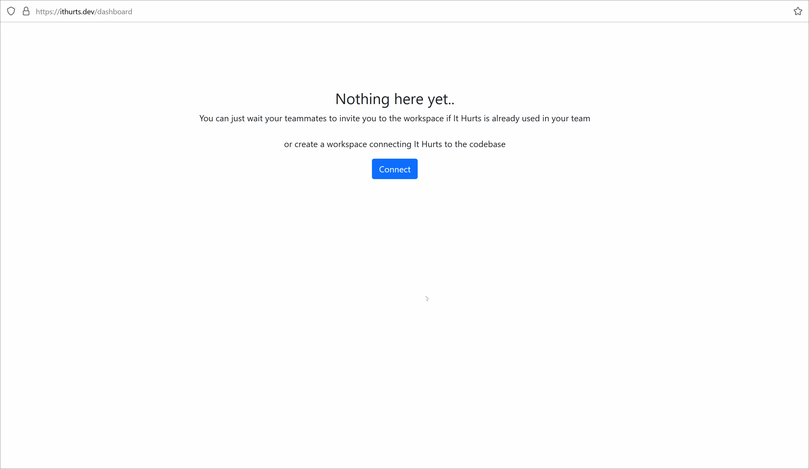

> **Note:** Unfortunately, for now, It Hurts for Bitbucket is not listed in Atlassian Marketplace, that's why you will
> need to enable development mode for your Bitbucket Cloud workspace to connect It Hurts to it. (If it is the case for you, 
> Bitbucket will show you a corresponding warning)
> 
> 

> 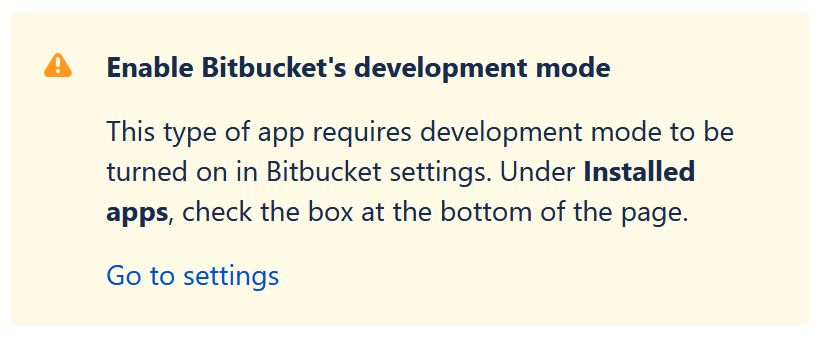
> 

### Teammates invitation
To invite team members to the workspace:

- Go to the web dashboard and click _Invite_ in the top-right corner
- Enter the email address of your new team member
- Click _Send invitation_

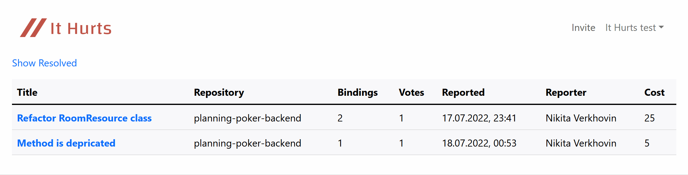

## Plugin setup
To start working with It Hurts you need to install a plugin for your IDE.

### Intellij IDEA (and other Intellij Platform IDEs)
Install plugin from <a href="https://plugins.jetbrains.com/plugin/18380-it-hurts-integration" target="_blank">JetBrains Marketplace</a>.
> Alternatively, in your IDE go to File -> Settings -> Plugins -> Marketplace tab. Search for _It Hurts_ and install _It Hurts Integration_ plugin

After plugin installed, in the IDE: 
- Go to Settings -> Tools -> ItHurts.
- Click _Connect to It Hurts_. You will be redirected to It Hurts, where if you are logged in, you will find an authorization code.
- Put the authorization code into _Code_ field in the settings dialog and click "Ok".
- If everything is fine, you will see _Logged as ..._ label in the settings dialog.

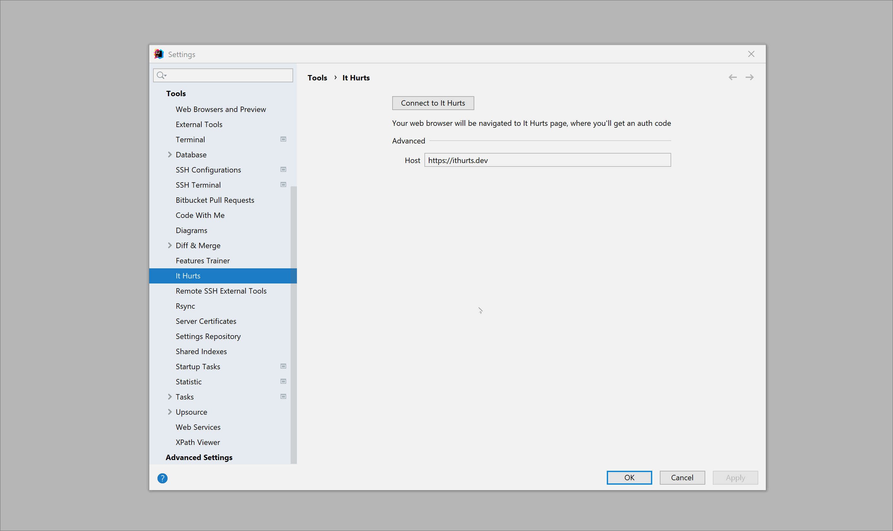

## Usage and features
### Reporting technical debt
With plugin installed and set up:
- Select some code in your IDE
- Right click -> Add Debt Binding (Report Debt)
- Select one of suggested options for the first code binding
- _[Optional] Add more bindings repeating the steps above_
- Fill title and description fields 
- Click _Submit_

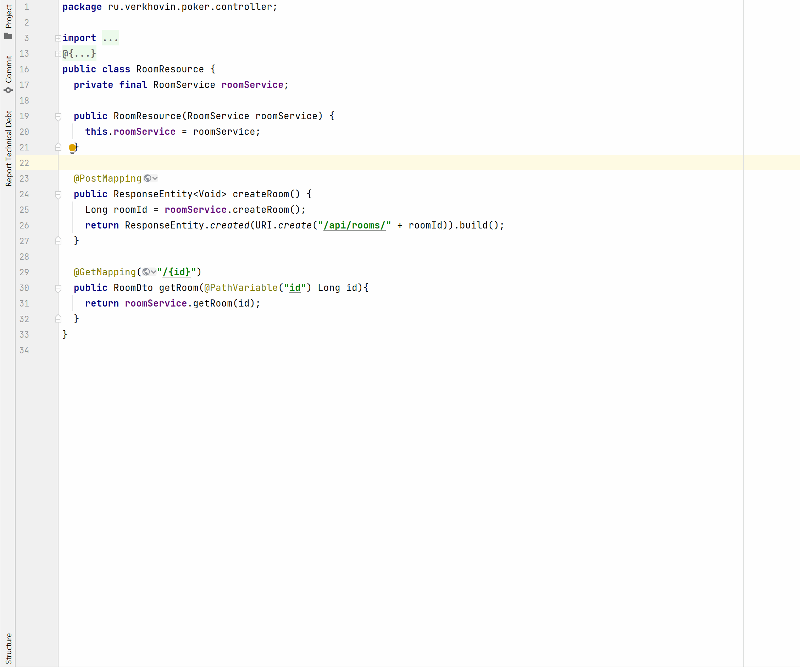

> Multiple binding options are available if advanced binding feature is supported for the given programming language
> (currently, Java and Kotlin)

As a result, a new ticket appears on a web dashboard (https://ithurts.dev/dashboard). Click on its name to see the details:

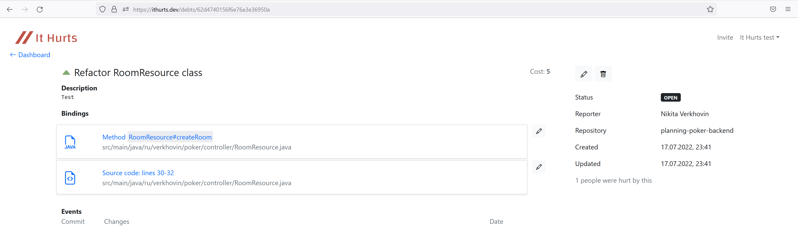

### Browsing technical debts
The code fragments bound to technical debts in It Hurts are marked by gutter icons:

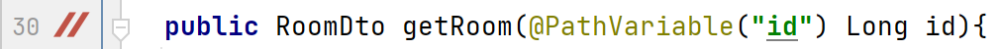

Click on the icon opens the debt the fragment is bound to:

  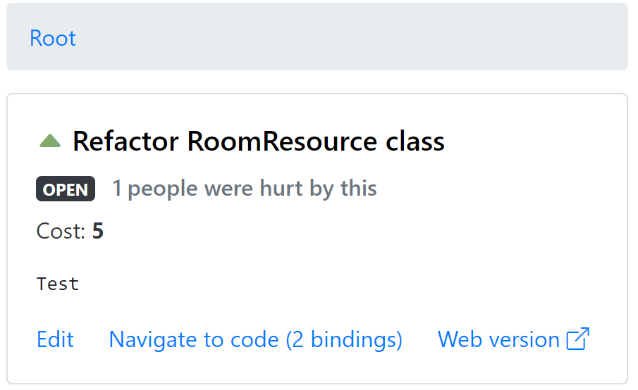

Plugin also provides the following actions:

- Show File Technical Debts (shows all debts in the current file)
- Show Repository Technical Debts (shows all debts in the project)
- Fetch Technical Debts from It Hurts (syncs debts with the server)

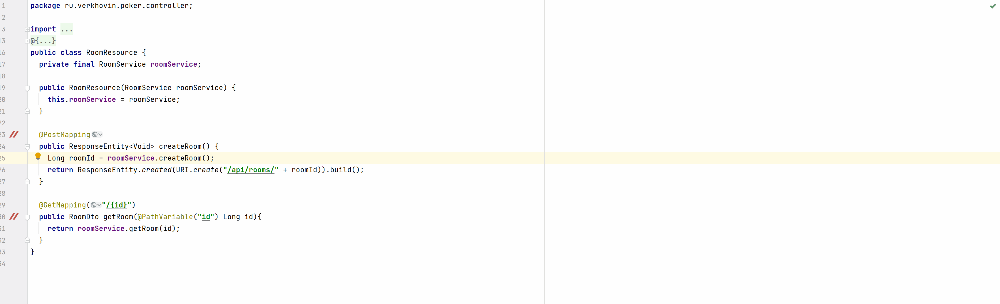

### Changes tracking and debt cost
It Hurts keeps track of changes that happen within code fragments bound to technical debts.
The feed of those changes can be found on the debt details web view:

 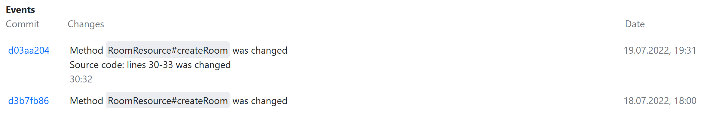

Debt **cost** index is a value that represents how expensive it is to keep the given technical debt in the codebase. It can be found
in the debt details:

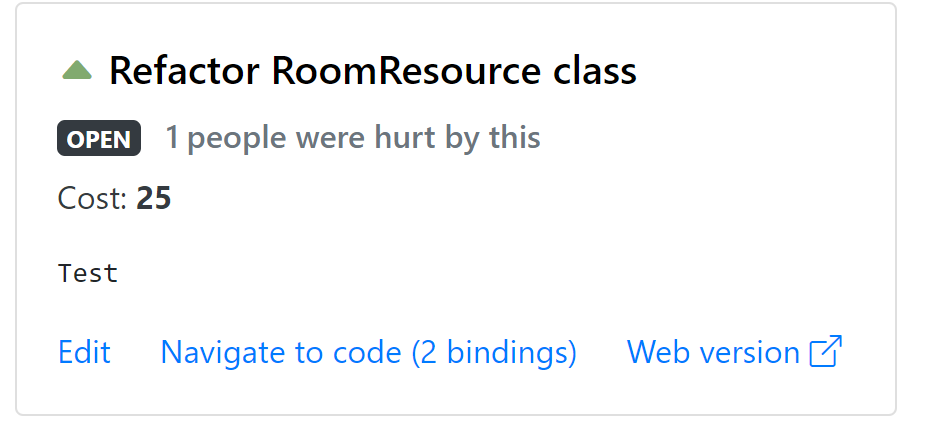
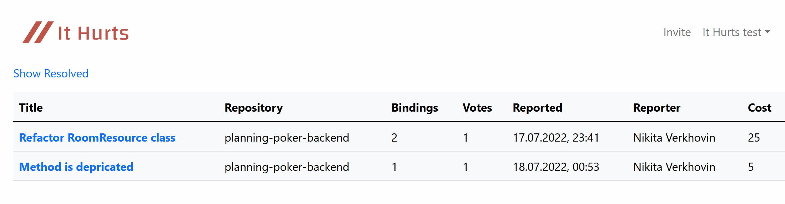

The cost is affected by the number of changes made with the code marked as technical debt 
and the number of votes under the debt. The higher those values are, the higher the cost. The debt cost index  must be considered
when prioritizing work on resolving technical debt.

### Types of bindings
**Binding** is a reference to a fragment of code considered as part of a technical debt. For example, the following debt 
has two bindings:

In general, binding simply points to code lines range. However, advanced bindings are supported
for certain (currently, Java and Kotlin) programming languages. 
**Advanced bindings** point to code entities like functions/methods or classes, not to code lines. 
This allows handling  changes in the code better, for example, keeping track of major code rearrangements,
renamings or parameter list changes. Keep in mind that to make it possible 
**the code is being processed on the server** on each commit pushed. 

In the example above, the debt has two bindings:

- The first one points to `createRoom()` in the `RoomResource` class. It will point to the same method no matter what 
changes are made to the method.
- The second one points to 30-33 lines range in the file. If some changes are made with the code within this range or above
the range can be expanded, shrunk, or moved.

For both cases, changes made to the code those bindings reference will be tracked, displayed in the debt details, 
and considered in the cost calculation.