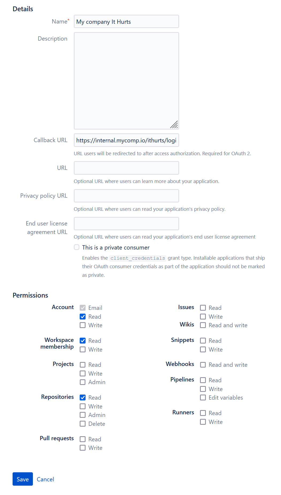
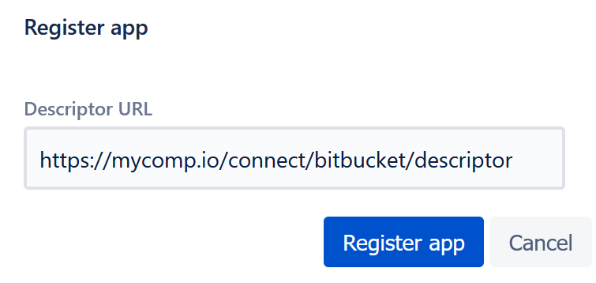

# Using It Hurts On-Premise

You can run and host It Hurts server by your self. This page describes the steps you should follow to do that.

- [Prerequisite](#prerequisite)
- [OAuth consumer](#oauth-consumer)
    - [Bitbucket](#bitbucket)
- [Run the instance](#run-the-instance)
    - [Keys](#keys)
    - [Docker](#docker)
    - [Compile and run](#compile-and-run)
- [Atlassian Connect app setup](#atlassian-connect-app-setup)
- [Example: full local setup](#example-full-local-setup)

## Prerequisite

- A machine / server that
    - accessible through public domain
    - capable of running Docker **or** build and run Java apps (JDK 11)
- MongoDB instance accessible from the machine

## OAuth consumer

### Bitbucket

To let user authenticate in self-hosted instance you have to create OAuth consumer in your Bitbucket account.

- Go to your Bitbucket workspace -> Settings -> OAuth consumer
- Click _Add Consumer_
- Come up with some name for your consumer, for example, _My company name_
- Callback URL field must be set to _https://{your.host}/login/oauth2/code/bitbucket_
- In **Permissions** section set **Read** permission for **Account**, **Workspace Membership**, **Repositories**
- Click Save

As a result, you should have OAuth consumer details like this:

<p align="center">
  
</p>

For a created consumer **Key** and **Secret** will be assigned. They can be found in the list of existing OAuth
consumer.
**You will need them for further configuration.**

## Run the instance

### Keys

You will need to generate a few security keys and pass them to the instance setting them to your environment variables:

- API JWT key. Used to sign and check the signature of JWT tokens issued for API consumers. Must be at least 32 bytes (
  character) in length, expected to be set to `ITHURTS_SECURITY_JWT_KEY` env variable
- Credentials encryption key. Some sensitive data in the database needs to be encrypted and the key for the encryption
  algorithm must be provided. Expected to be set to `ITHURTS_CRED_ENCRYPTION_KE` env variable

### Docker

You can build It Hurts from sources and run the instance just by starting a docker container based on the `Dockerfile`
located in the root of the [repository](https://github.com/verkhovin/ithurts).

To do that download or clone the repository and build the docker image, it will take a couple of minutes:

```shell
 git clone https://github.com/verkhovin/ithurts.git
 cd ithurts
 docker build -t ithurts-self .
```

And then run the container:

```shell
docker run -d \
--env ITHURTS_BASEURL={https://your.host} \
--env ITHURTS_BITBUCKET_APPNAME={Atlassian Connect app name} \
--env ITHURTS_BITBUCKET_CLIENT_ID={Bitbucket OAuth consumer key} \
--env ITHURTS_BITBUCKET_CLIENT_SECRET={Bitbucket OAuth consumer sercret} \
--env ITHURTS_SECURITY_JWT_KEY={Generated key} \
--env ITHURTS_CRED_ENCRYPTION_KEY={Generated key} \
--env SPRING_DATA_MONGODB_URI={Connection uri} \
-p 8080:8080 \
ithurts-self 
```

this command also passes a few environment variables to the container:

- `ITHURTS_BASEURL`- public address of to the self-hosted instance
- `ITHURTS_BITBUCKET_APPNAME` - application name will be used as an Atlassian Connect app name, must be unique from
  Bitbucket cloud perspective; for example: `MyCompany-ItHurts`
- `ITHURTS_BITBUCKET_CLIENT_ID` - bitbucket OAuth consumer key you got [when creating OAuth consumer](#oauth-consumer)
- `ITHURTS_BITBUCKET_CLIENT_SECRET` - bitbucket OAuth consumer secret you
  got [when creating OAuth consumer](#oauth-consumer)
- `ITHURTS_CRED_ENCRYPTION_KEY` - [self-generated key](#keys)
- `ITHURTS_SECURITY_JWT_KEY` - [self-generated key](#keys)
- `SPRING_DATA_MONGODB_URI` - MongoDB connection string

### Atlassian Connect app setup

The final step is to connect the instance to the Bitbucket cloud, to do so:

- Go to your Bitbucket workspace -> Settings -> Develop apps
- Click _Register app_
- As a descriptor url use `https://{your.host}/connect/bitbucket/descriptor`

<p align="center">

</p>

## Example: full local setup

... To be done ...